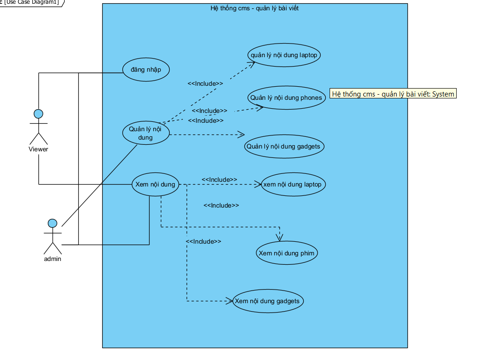
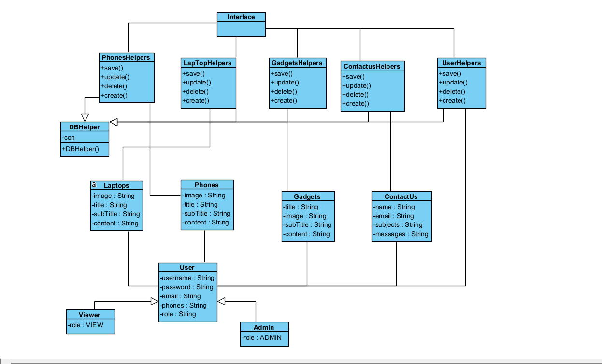
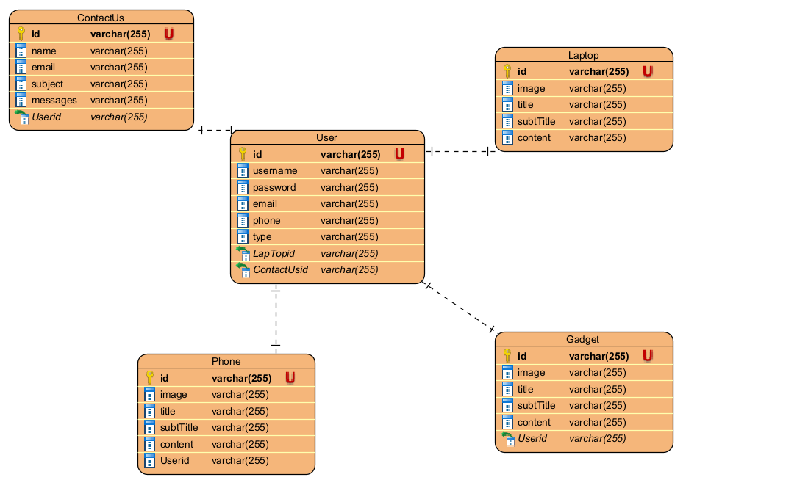

# Hệ thống cms

## Sơ đồ usecase hệ thống 

----

--- 

## Kịch bản chuẩn cho các usecase :

***Đọc tại đây :***

https://docs.google.com/document/d/1gMnLJc9FGYCF0kxzdEQvsdf8sL8ACm7GNU6pNgNrj-g/edit?tab=t.0

## Thiết kế biểu đồ lớp chi tiết cho các usecase :

* Modeling hóa thực thể và viết các lớp giao diện và các hàm cần thiết

 ---
 
 ---

## Database cho hệ thống

---

---

# Triển khai hệ thống với web-platform với Laravel