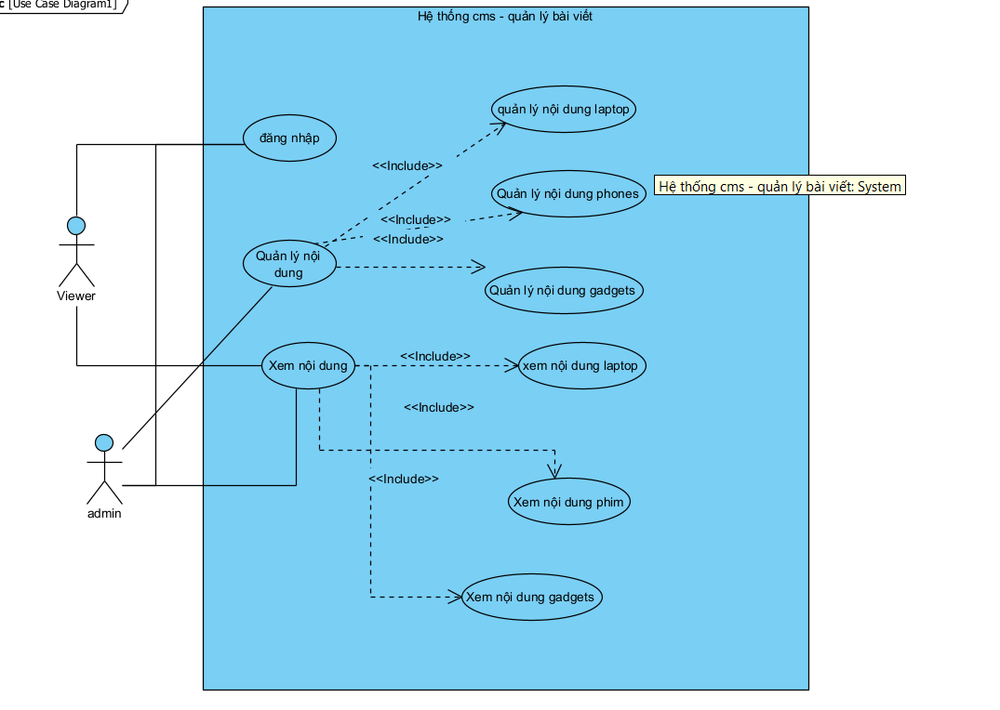
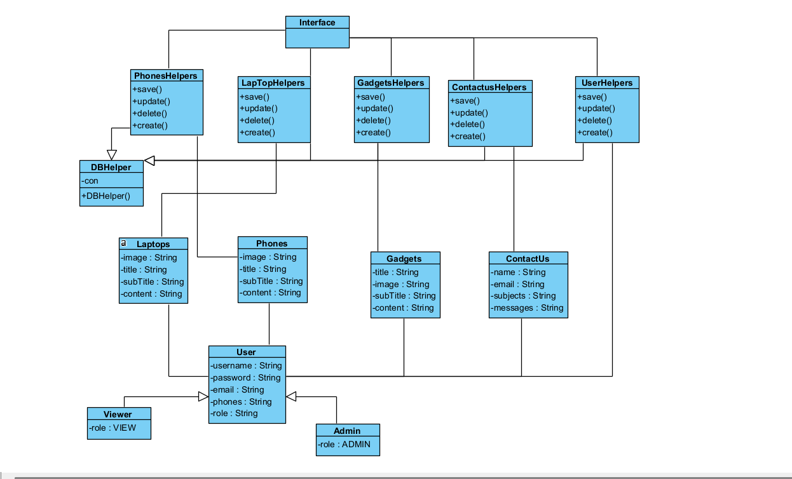
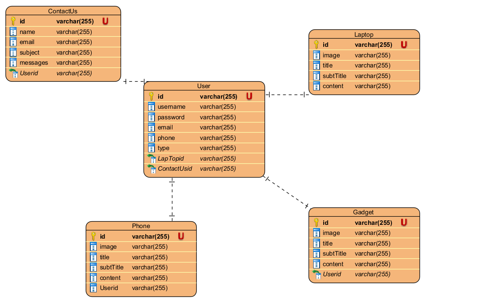

# Laravel CMS - Hệ Thống Quản Lý Nội Dung

Một hệ thống quản lý nội dung (CMS) được xây dựng bằng Laravel 12 với giao diện quản lý admin và trang web công khai.

##  Sơ Đồ UseCase Hệ Thống



##  Kịch Bản Chuẩn Cho Các UseCase

***Đọc chi tiết tại đây:***

https://docs.google.com/document/d/1gMnLJc9FGYCF0kxzdEQvsdf8sL8ACm7GNU6pNgNrj-g/edit?tab=t.0

##  Thiết Kế Biểu Đồ Lớp Chi Tiết Cho Các UseCase

Modeling hóa thực thể và viết các lớp giao diện và các hàm cần thiết:



##  Database Cho Hệ Thống



---

# Mục Lục

- [Giới Thiệu](#giới-thiệu)
- [Cấu Trúc Project](#cấu-trúc-project)
- [Cài Đặt](#cài-đặt)
- [API Endpoints](#api-endpoints)
- [Database](#database)
- [Các Module Chính](#các-module-chính)

##  Giới Thiệu

**Laravel CMS** cung cấp:
-  Trang web công khai hiển thị sản phẩm (Laptop, Điện thoại, Gadget)
-  Admin dashboard để quản lý nội dung
-  Lưu trữ ảnh sản phẩm trong `storage/app/public`
-  Hỗ trợ HTTPS khi deploy bằng ngrok
-  Build tool Vite cho CSS/JS development

##  Cấu Trúc Project

```
laravel_cms/
├── app/
│   ├── Http/
│   │   ├── Controllers/
│   │   │   ├── AdminController.php         # Điều khiển trang admin
│   │   │   ├── LaptopController.php        # CRUD Laptop
│   │   │   ├── PhoneController.php         # CRUD Điện thoại
│   │   │   ├── GadgetController.php        # CRUD Gadget
│   │   │   └── ContactUsController.php     # Xử lý liên hệ
│   │   └── Requests/                       # Form validation
│   └── Models/
│       ├── Laptop.php                      # Model Laptop
│       ├── Phone.php                       # Model Điện thoại
│       ├── Gadget.php                      # Model Gadget
│       ├── ContactUs.php                   # Model Liên hệ
│       └── User.php                        # Model Người dùng
├── database/
│   ├── migrations/                         # Migrations tạo bảng
│   ├── seeders/                            # Seeders dữ liệu mẫu
│   └── factories/                          # Factories để test
├── public/
│   ├── css/                                # CSS files đã compile
│   ├── js/                                 # JS files đã compile
│   ├── fonts/                              # Icon/Font files
│   ├── images/                             # Static images
│   ├── storage/ → storage/app/public       # Symlink để access storage
│   └── build/                              # Vite compiled assets
├── resources/
│   ├── css/
│   │   ├── app.css                         # CSS cho Admin (Tailwind)
│   │   ├── layout.css                      # CSS chung
│   │   └── ... (CSS khác)
│   ├── js/
│   │   ├── app.js                          # JS cho Admin
│   │   ├── bootstrap.js                    # Setup axios
│   │   └── main.js                         # JS cho User
│   └── views/
│       ├── layouts/
│       │   ├── app.blade.php               # Layout Admin
│       │   └── frontend.blade.php          # Layout User
│       ├── web/
│       │   └── home/
│       │       ├── index.blade.php         # Trang chủ user
│       │       ├── phone.blade.php         # Danh sách điện thoại
│       │       ├── laptop.blade.php        # Danh sách laptop
│       │       ├── gadget.blade.php        # Danh sách gadget
│       │       └── contactUs.blade.php     # Form liên hệ
│       └── admin/
│           ├── home.blade.php              # Dashboard admin
│           ├── phones/                     # CRUD Điện thoại
│           ├── laptops/                    # CRUD Laptop
│           └── gadgets/                    # CRUD Gadget
├── routes/
│   ├── web.php                             # Web routes
│   └── api.php                             # API routes
├── storage/
│   └── app/public/                         # Ảnh sản phẩm được lưu ở đây
├── vite.config.js                          # Cấu hình Vite
├── composer.json                           # PHP dependencies
├── package.json                            # Node dependencies
└── .env                                    # Environment variables
```

##  Cài Đặt

### Yêu Cầu
- PHP 8.2+
- Node.js 18+
- Composer
- MySQL 5.7+

### Bước Cài Đặt

1. **Clone repo và cài dependencies**
```bash
cd laravel_cms
composer install
npm install
```

2. **Setup environment**
```bash
cp .env.example .env
php artisan key:generate
```

3. **Cấu hình database trong .env**
```env
DB_HOST=127.0.0.1
DB_PORT=3308
DB_DATABASE=laravel_cms
DB_USERNAME=root
DB_PASSWORD=
```

4. **Chạy migrations và seed**
```bash
php artisan migrate:refresh --seed
```

5. **Tạo symlink để access storage**
```bash
php artisan storage:link
```

6. **Chạy development server**

Terminal 1 - Laravel Server:
```bash
php artisan serve
```

Terminal 2 - Vite Dev Server (cho admin):
```bash
npm run dev
```

Truy cập:
-  User: https://pasty-unscarce-magnanimously.ngrok-free.dev/user/home
-  Admin: https://pasty-unscarce-magnanimously.ngrok-free.dev/admin/home

    + email : admin@gmail.com
    + password : admin123

##  API Endpoints

### Laptops
| Method | Endpoint | Mô Tả |
|--------|----------|-------|
| GET | `/api/laptops` | Lấy danh sách laptops |
| POST | `/api/laptops` | Tạo laptop mới |
| GET | `/api/laptops/{id}` | Lấy chi tiết laptop |
| PUT | `/api/laptops/{id}` | Cập nhật laptop |
| DELETE | `/api/laptops/{id}` | Xóa laptop |

### Phones (Điện Thoại)
| Method | Endpoint | Mô Tả |
|--------|----------|-------|
| GET | `/api/phones` | Lấy danh sách điện thoại |
| POST | `/api/phones` | Tạo điện thoại mới |
| GET | `/api/phones/{id}` | Lấy chi tiết điện thoại |
| PUT | `/api/phones/{id}` | Cập nhật điện thoại |
| DELETE | `/api/phones/{id}` | Xóa điện thoại |

### Gadgets
| Method | Endpoint | Mô Tả |
|--------|----------|-------|
| GET | `/api/gadgets` | Lấy danh sách gadgets |
| POST | `/api/gadgets` | Tạo gadget mới |
| GET | `/api/gadgets/{id}` | Lấy chi tiết gadget |
| PUT | `/api/gadgets/{id}` | Cập nhật gadget |
| DELETE | `/api/gadgets/{id}` | Xóa gadget |

### Contact (Liên Hệ)
| Method | Endpoint | Mô Tả |
|--------|----------|-------|
| POST | `/api/contact` | Gửi thông tin liên hệ |
| GET | `/api/contact` | Lấy danh sách liên hệ |

### Web Routes (Frontend)
| Method | Endpoint | Mô Tả |
|--------|----------|-------|
| GET | `/` | Trang chủ |
| GET | `/phones` | Danh sách điện thoại |
| GET | `/laptops` | Danh sách laptop |
| GET | `/gadgets` | Danh sách gadget |
| GET | `/contact-us` | Trang liên hệ |
| POST | `/contact-us` | Gửi form liên hệ |

##  Database

### Bảng Chính

**laptops**
- `id` - ID laptop
- `name` - Tên
- `price` - Giá
- `description` - Mô tả
- `image` - Ảnh (lưu path như: `gadgets/1772537367_anh1.jpg`)
- `user_id` - Người tạo
- `created_at`, `updated_at`

**phones**
- `id` - ID điện thoại
- `name` - Tên
- `price` - Giá
- `description` - Mô tả
- `image` - Ảnh
- `user_id` - Người tạo
- `created_at`, `updated_at`

**gadgets**
- `id` - ID gadget
- `name` - Tên
- `price` - Giá
- `description` - Mô tả
- `image` - Ảnh
- `user_id` - Người tạo
- `created_at`, `updated_at`

**contact_us**
- `id` - ID
- `name` - Tên người liên hệ
- `email` - Email
- `message` - Nội dung
- `created_at`, `updated_at`

**users**
- `id` - ID
- `name` - Tên
- `email` - Email
- `password` - Mật khẩu
- `created_at`, `updated_at`

##  Các Module Chính

### 1. Laptop Management
- **Controller**: `LaptopController`
- **Model**: `Laptop`
- **Views**: `admin/laptops/`, `web/home/laptop.blade.php`
- **Routes**: `/laptops` (web), `/admin/laptops` (admin), `/api/laptops` (api)

### 2. Phone Management
- **Controller**: `PhoneController`
- **Model**: `Phone`
- **Views**: `admin/phones/`, `web/home/phone.blade.php`
- **Routes**: `/phones` (web), `/admin/phones` (admin), `/api/phones` (api)

### 3. Gadget Management
- **Controller**: `GadgetController`
- **Model**: `Gadget`
- **Views**: `admin/gadgets/`, `web/home/gadget.blade.php`
- **Routes**: `/gadgets` (web), `/admin/gadgets` (admin), `/api/gadgets` (api)

### 4. Contact Management
- **Controller**: `ContactUsController`
- **Model**: `ContactUs`
- **Views**: `web/home/contactUs.blade.php`
- **Routes**: `/contact-us` (web), `/api/contact` (api)

### 5. Admin Dashboard
- **Controller**: `AdminController`
- **Views**: `admin/home.blade.php`
- **Features**: Thống kê sản phẩm, quản lý nội dung


Ảnh sản phẩm được lưu vào:
```
storage/app/public/gadgets/
storage/app/public/laptops/
storage/app/public/phones/
```

Access ảnh qua:
```blade
{{ asset('storage/' . $product->image) }}
```


```bash
# Clear cache
php artisan cache:clear
php artisan config:clear

# Reset database
php artisan migrate:refresh --seed

# Create storage symlink
php artisan storage:link

# Generate app key
php artisan key:generate

# Build assets
npm run build

# Dev assets
npm run dev
```
